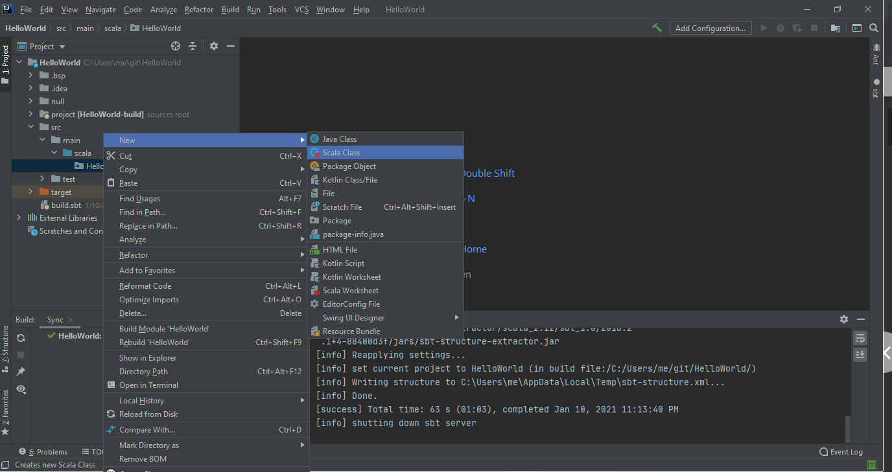

## Steps to execute the Scala program in IntelliJ Idea2020.2

1. Open the installed IntelliJ IDE
2. Click on File -> New -> Project
3. Select 'sbt'. Click Next

4. Enter project name as HelloWorld, select JDK version, sbt version and SCala version and click Finish

5. Intellij will take some time to import and extract the project. When it shuts down the sbt server, continue.
6. Right click the 'HelloWorld' folder and select 'Add Framework Support'
7. Checkmark the Scala option and click OK.

8. Expand the HelloWorld folder.
9.  Expand the 'src' folder.
10. Expand the 'main' folder.  There will be a 'scala' folder inside main.
11. Right click the 'scala' folder and select New -> Package
12. Name the package 'HelloWorld'
13. Right click the 'HelloWorld' package and select New -> Scala Class

14. Highlight Object and enter the name 'HelloWorld' and press Enter

15. Type the first Scala program in the HelloWorld.scala window

16. Click the green triangle next to "object HelloWorld" to compile and run. 
17. Alternatively, click Run -> Run 'HelloWorld' (shift + F10)
